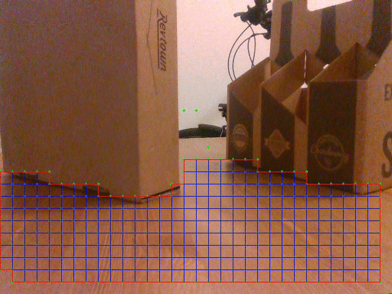
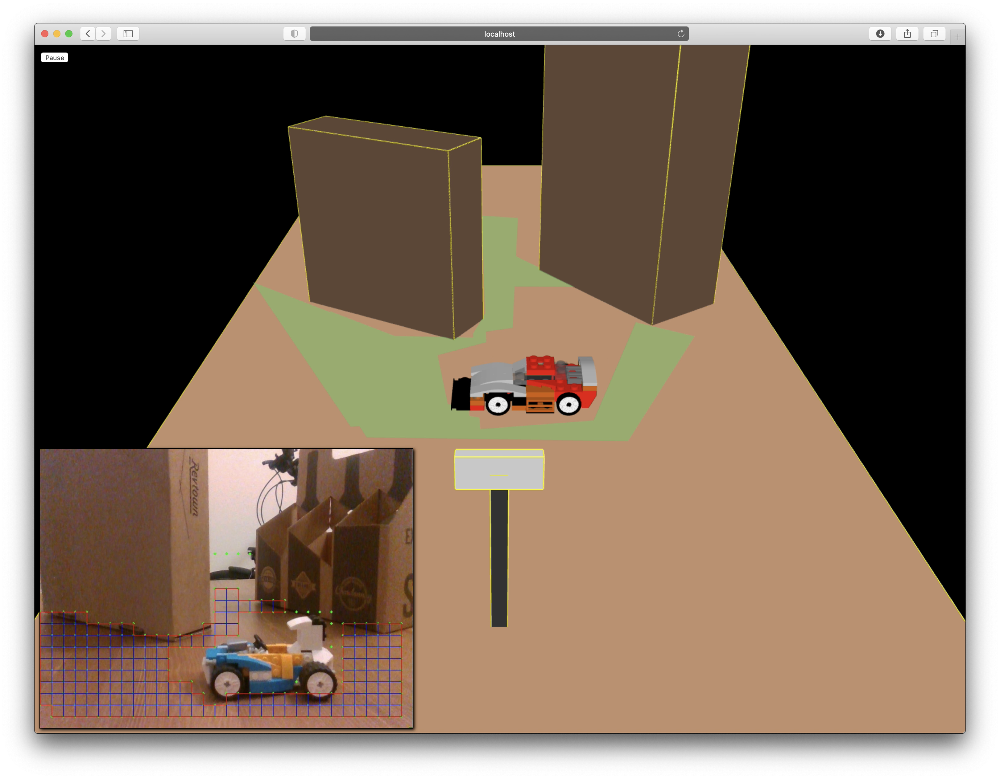
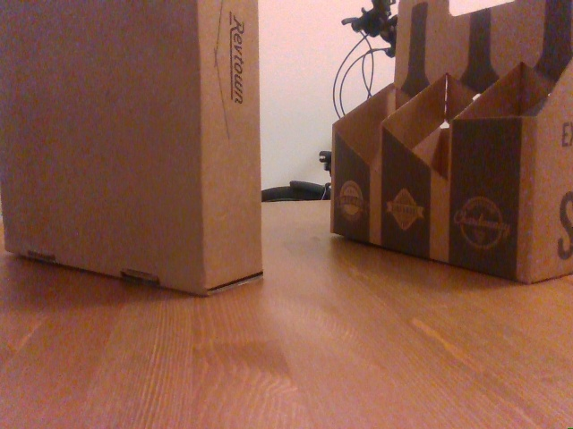
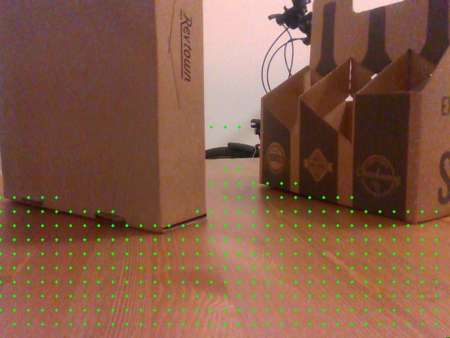
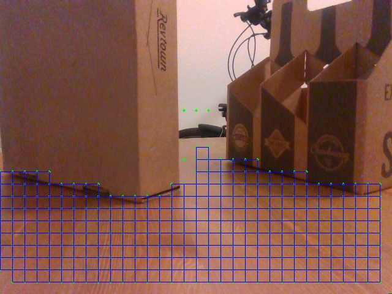
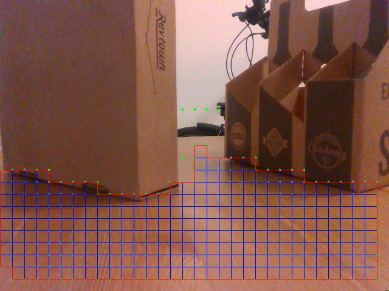
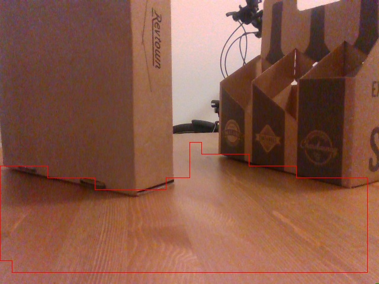
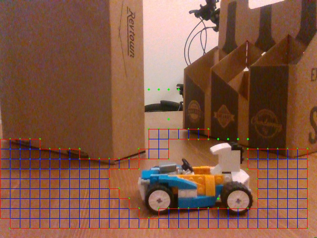

# Visible Polygon Extractor

## Application overview

Modern C++ app to process the raw sensor output of Intel RealSense D400 series camera for extracting visible polygon
representing the ground surface (visible ground polygon). Sensing the ground surface and identifying visible or drivable
area is often a first step in the perception system of any robotics application.



**Visible Polygon Extractor** makes extensive use of the following libraries:

- Boost Graph Library: for connected components and breadth first search graph traversal
- Boost Geometry: for basic geometric types and geometric algorithms (union and simplification)
- Intel RealSense SDK: for interacting with RealSense D400 series camera and utilize post-processing algorithms
  (hole filling filter and point cloud calculations)

Visualize the images and visible ground polygon data in 3D using **Visible Polygon Visualizer**
[GitHub link](https://github.com/sidthakur/visible-polygon-visualizer)



## Algorithm overview

The high-level algorithm implemented to extract the visible ground polygon is as follows:

1. Calculate the point cloud using Intel RealSense SDK

2. Transform the point cloud to account for camera tilt and orientation



Test setup: camera setup with a slight tilt (10 deg roll, 0.5 deg yaw) looking at two fixed obstacles (cardboard boxes)
placed on a table. Camera stand ~ 12 cm tall

3. Identify points near the ground surface for selected points forming a 2d grid of with a parameterized `step`. Green
   dots in the visual below are points near ground level (camera stand +/- 1 cm).



4. Identify ground level rectangles (in the pixel domain) to find the boundary of the ground surface. Build a graph of
   adjacent rectangles to identify connected components. Performing calculations in the pixel domain will help speed up
   the computations. Blue rectangles in the visualization below represent the ground pixel rectangles.



5. Merge connected ground rectangles (in the pixel domain) to find the outer boundary of the visible ground polygon. Red
   outline in the visualization below represents the boundary of the visible ground polygon



6. Convert the visible ground polygon from pixel domain to cartesian (x, y, z) domain using the measurements from the
   depth frame.



## Performance overview

`step` can be tuned based on the required resolution for the target application. Basic performance figures for the app
consuming an 640 x 480, RGB stream & an 848 x 480, Depth stream is as below

* `step` set to `20 pixels` ~ frame rate: `10 Hz`
* `step` set to `30 pixels` ~ frame rate: `15 Hz`

## Use-case

This application can be used to process data from the Intel RealSense D400 series camera in a fixed setting or on a
moving target. It can be used to extract and transmit the visible ground polygon that can be consumed or visualized by a
end user.

**TODO**: extend capability to transmit visible ground polygon data and create a consumer / visualizer for the data.



## Setup

Conda is a helpful utility to manage environments on multiple platforms including macos.
Install [Conda on MacOS](https://docs.conda.io/projects/conda/en/latest/user-guide/install/macos.html)

1. Create new environment (to be performed only once)

```shell
conda create --name vpe
```

2. Activate the conda environment (to be performed in each new shell)

```shell
conda activate vpe
```

Set `CMAKE_PREFIX_PATH` to `CONDA_PREFIX` in the shell as well as IDE to using the libraries installed in conda env

3. Install essential tools and dependencies

Install essential tools and dependencies for librealsense2 (version: 2.39.0) using the
[guide](https://github.com/IntelRealSense/librealsense/blob/v2.39.0/doc/installation_osx.md)
provided by realsense. Prefer install tools and dependencies into a clean environment using conda.

cmake: using conda

```shell
conda install -c anaconda cmake
```

libusb: using conda

```shell
conda install -c conda-forge libusb
```

pkg-config: using conda

```shell
conda install -c conda-forge pkg-config
```

libopencv: using brew

```shell
brew install opencv@3
```

Add `/usr/local/opt/opencv@3/` to `CMAKE_PREFIX_PATH` to use the `libopencv` installed via brew

boost: using brew

```shell
brew install boost
```

Add `/usr/local/Cellar/boost/1.75.0/` to `CMAKE_PREFIX_PATH` to use `libboost` installed via brew

json: using conda

```shell
conda install -c conda-forge nlohmann_json
```

4. Clone and build third party dependencies

apriltag (version 3.13.0): build from source

```shell
git submodule add https://github.com/AprilRobotics/apriltag.git third-party/apriltag
git checkout v3.1.3
```

Commented out line 64-95 in `apriltag/CMakeLists.txt` to ignore python wrappers

```shell
cmake -DCMAKE_PREFIX_PATH=$CONDA_PREFIX -DCMAKE_INSTALL_PREFIX=$CONDA_PREFIX -S . -B build
cmake --build build --target install
```

librealsense2 (version: 2.39.0): build from source using the
[guide](https://github.com/IntelRealSense/librealsense/blob/v2.39.0/doc/installation_osx.md)
provided by realsense

Clone and checkout tag v2.39

```shell
git submodule add https://github.com/IntelRealSense/librealsense.git third-party/librealsense
cd third-party/librealsense
git checkout v2.39.0
cmake -DCMAKE_PREFIX_PATH=$CONDA_PREFIX -DCMAKE_INSTALL_PREFIX=$CONDA_PREFIX -S . -B build
cmake --build build --target install
cd ${CONDA_PREFIX}/lib
install_name_tool -change libusb-1.0.0.dylib @rpath/libusb-1.0.0.dylib librealsense2.dylib
```

Set `DYLD_LIBRARY_PATH` and `PATH` to include the right libraries into path. Run the following script after activating
the conda env

```shell
source macos_env.sh
```

## Build

Make sure to configure IDE and shell to use appropriate `CMAKE_PREFIX_PATH` `DYLD_LIBRARY_PATH` and `PATH`. Build using
CMake.

```shell
conda activate vpe
source macos_env.sh
cmake -DCMAKE_PREFIX_PATH=$CONDA_PREFIX -S . -B build
cmake --build build
```